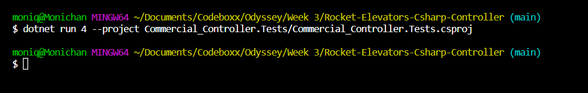
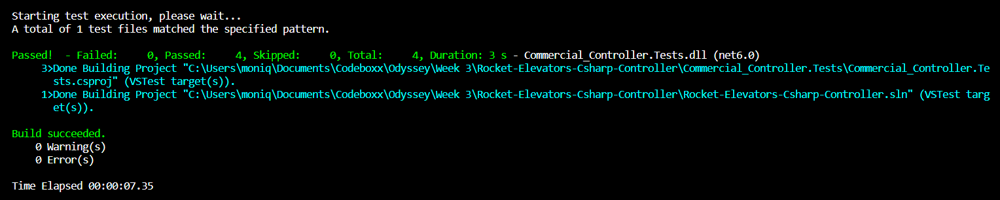

# Rocket-Elevators-Csharp-Controller
This is the Rocket Elevator controller made from a template to use for the C# commercial controller. In the Commercial_Controller folder, you will find all the classes that should be used along with the methods needed to pass the some tests. The necessary files to run those tests are also included, in the Commercial_Controller.Tests folder.

This Commercial controller is a programme to control elevators in a commercial building. It is made of a battery of columns containing each a certain amount of elevators. In this program, fictional users are calling elevators from the lobby on a central panel to go on a specific floor or from a different floor to return to the lobby. In this system, a user cannot go from a upper or basement floor to another upper or basement floor. The user is in the obligation to return to the lobby first.

Once the fictional user has press a button to request an elevator, the program choose the best elevator to send to pick up the user by evaluating the elevator positions, what it is presently doing (its status) and what floor it is deserving. After evaluating each possible elevator and attributing them a score each, the program choose the elevator with the best score and make it move to pick up and drop the user from and to the right floor. 

### Installation

As long as you have **.NET 6.0** installed on your computer, nothing more needs to be installed:

The code to run the scenarios is included in the Commercial_Controller folder, and can be executed there with:

`dotnet run <SCENARIO-NUMBER>`

### Running the tests

To launch the tests, make sure to be at the root of the repository and run:

Scenario 1:
`dotnet run 1 --project Commercial_Controller.Tests/Commercial_Controller.Tests.csproj`

Scenario 2:
`dotnet run 2 --project Commercial_Controller.Tests/Commercial_Controller.Tests.csproj`

Scenario 3:
`dotnet run 3 --project Commercial_Controller.Tests/Commercial_Controller.Tests.csproj`

Scenario 4:
`dotnet run 4 --project Commercial_Controller.Tests/Commercial_Controller.Tests.csproj`

With this fully completed project, you wil not get any output like this:

You can also get more details about each test by adding the `-v n` flag: 

`dotnet test -v n`

which should give something like: 

### Using the program

In Program.cs on 10 enter the scenario number you want to run (1, 2, 3 or 4). For example if you want to run the second scenario, you need to replace the <scenarioNumber> between the brackets.

Before:
int scenarioNumber = Int32.Parse(args[0]);
Scenarios scenarios = new Scenarios();
scenarios.run(scenarioNumber);

After:
int scenarioNumber = Int32.Parse(args[0]);
Scenarios scenarios = new Scenarios();
scenarios.run(2);

To be able to run the program, you need to enter a scenario number or an error will occur. 